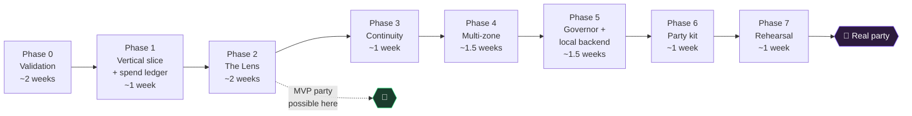

# EGREGORE — Implementation Plan

| | |
|---|---|
| **Version** | v0.1 (draft) |
| **Date** | 2026-08-28 |
| **Author** | Benjamin Life ([@omniharmonic](https://github.com/omniharmonic)) |
| **Status** | Draft for review |
| **Document** | 3 of 3 — [PRD](./egregore-01-prd.md) → [Technical Architecture](./egregore-02-architecture.md) → *Implementation Plan* |

---

## 1. Strategy

Three commitments shape this plan.

**Kill the risky assumptions first.** Eight load-bearing assumptions (Architecture §9) could each invalidate a chunk of the design. Phase 0 tests all of them in about two weeks of throwaway scripts, before a line of real system code exists. Phase 0 is cheap and its findings are worth more than any amount of upfront design.

**Get to a beautiful screen fast, then make it a system.** The build order is deliberately not bottom-up. Phase 1 produces one ugly-but-working end-to-end path; Phase 2 makes it *beautiful*. Beauty is the actual product risk, and it should be confronted early rather than deferred behind infrastructure.

**Every phase after 2 is party-viable.** From Phase 2 onward there is always a version you could run at a real event. Scope can be cut at any boundary without leaving a half-built thing.

### Milestone map



Roughly **11 weeks** of focused part-time work to a fully realized system; **~5 weeks** to something you could genuinely run at a party.

> **On the MVP boundary.** Phase 2 is party-viable *only* because the spend ledger and hard ceiling moved into Phase 1. An earlier draft placed them in Phase 5 while still calling Phase 2 party-ready — which would have meant running live Veo generation with no ceiling, violating PRD B-2 and the operator's single most important stated need. Never run a real party on a build without the ceiling.
>
> Phase 2 is still short of full P0 coverage: it is single-zone (L-1), hardcodes the aesthetic grammar (T-4), has no preset configs (G-1/G-2), and has no printed signage (P-5 — which the operator must instead handle manually and verbally). Those are acceptable gaps for a friendly house party run by the person who built it. They are not acceptable for an event with strangers.

---

## 2. Phase 0 — Validation spikes

**Duration:** ~2 weeks · **Output:** a findings document, not code

Seven independent scripts, each answering one question, each thrown away afterward. No architecture, no abstractions, no tests.

Two weeks rather than one, because several spikes have irreducible latency: S-3 needs a 24-hour billing reconciliation, S-4 needs access to a real gathering, S-5 needs hardware with lead times, and S-7 explicitly expects iteration. These run concurrently, but they do not compress.

| Spike | Question | Method | Go/no-go |
|---|---|---|---|
| **S-1** | What is Veo's real extension ceiling — and **which tiers support extension and image-seeding at all**? | Chain extensions on one clip until the API refuses. Log count, total duration, error. Repeat on Lite, Fast, and Quality. | Records actual limit; feeds Loom's `max_chain_length`. **If Lite lacks extension or image-seed, the default config and the entire cost model must change tier.** |
| **S-2** | Is last-frame handoff seamless — **including direction of motion**? | Generate a clip, `ffmpeg` its last frame, use as image-to-video seed, repeat ×3. Judge composition *and* whether drift direction/velocity carries across. Test with and without a motion descriptor in the seeding prompt. | **Critical.** If seams are obvious, continuity mode needs redesign |
| **S-3** | What does Veo actually cost? | Generate 10 clips at known durations, audio on and off. Reconcile against billing console 24h later. | Establishes the Governor's cost table |
| **S-4** | Does Parakeet survive a party? | Record 20 min of realistic conditions — music at party volume, 3+ overlapping talkers, laughter. Run offline. | Measure hallucination rate during non-speech. If bad, test VAD aggressiveness, then fall back to Whisper |
| **S-5** | Is local generation fast enough to matter? | Install **ComfyUI + LTX-2 on the Spark first** and time 10 generations. Only if that is too slow does the consumer GPU box need buying — then re-time on the same stack. Comparing ComfyUI to a native Diffusers pipeline proves nothing about hardware. | Determines whether local is a live-party backend or an installation-only backend. Sequenced this way so the spike does not depend on hardware the spike is meant to justify buying. |
| **S-6** | Will screens hold 60fps? | Hand-write shader stacks of 3, 4, and 6 passes over a 1080p video; run each on the cheapest intended screen device. | Records max passes at 60fps on target hardware; sets the shader complexity budget and confirms or corrects assumption A-6 |
| **S-7** | **Is the imagery actually beautiful?** | Take 5 real conversation excerpts. Hand-write theme objects. Draft 3 candidate aesthetic grammars. Generate 30 clips. Judge them on a real screen in a dark room. | **The most important spike.** Determines whether the aesthetic thesis holds |

**On S-7.** This is the spike that decides whether the project is worth building. Everything else is tractable engineering; this one asks whether abstracted conversation themes plus a good grammar actually yield imagery you'd want on your wall. Budget real money and real attention here — generate far more than 30 clips if the first 30 are ambiguous. It is much cheaper to discover a weak aesthetic thesis now than after building an orchestration layer around it.

**Exit criteria:** a written findings doc with a decision on each spike, updated cost table, and any resulting architecture amendments.

---

## 3. Phase 1 — Vertical slice

**Duration:** ~1 week · **Output:** one zone, end to end, deliberately ugly (the spend ledger is small; it does not extend the phase)

Prove the whole pipeline connects. One mic, one screen, no shaders, no cadence solving or spend curves, no continuity, no config file — but *with* the spend ceiling, which is non-negotiable from the first paid API call.

**Build:**
- USB mic capture with VAD gating
- Parakeet transcription into a ring buffer
- Generation with `generateAudio: false` (V-3) — the cost model assumes it from the first call
- Local LLM: ring buffer → theme object → prompt (both stages, with the full validator — the privacy boundary is built in from the first commit, never retrofitted)
- **Spend ledger with reservation and hard ceiling.** Moved up from Phase 5. It is a few hundred lines, and no build that calls a paid API should exist without it. The cadence solver and spend curve can wait; the ceiling cannot.
- Veo generation, fixed cadence, hardcoded
- FastAPI serving a manifest and clip files
- A dumb HTML page that plays clips back to back

**Explicitly deferred:** shaders, crossfades, multi-zone, cadence solving, spend curves, continuity, local backend, remote access, config file, dashboard.

**Exit criteria:** Speak near the mic about a distinctive topic. Within a few minutes, thematically related abstract video appears on the screen. Ring buffer verified to evict on schedule and to write nothing to disk. Setting a $2 ceiling stops generation at $2.

**Verification — `test_privacy.py`.** This is billed as the test that must never fail, so its specification needs to be exact. An earlier draft said "no file contains any substring of the transcribed text," which can never pass — every single character is a substring.

The actual assertion, run against a fixture transcript so it works in CI with no live audio:

1. Feed a fixture transcript containing rare sentinel tokens (invented proper nouns, a distinctive 8-word phrase, a fake phone number) through the full Weaver path.
2. Assert no artifact written during the run — files, logs, the clip store, the manifest, the outbound prompt — contains **any word-level 3-gram** from the fixture, **any 12-character contiguous run** from it, or any sentinel token.
3. Assert the outbound prompt specifically, since it is the only thing that can leave.
4. Assert the ring buffer is empty after its window elapses, and that a forced exception mid-synthesis leaks no content into the traceback.

---

## 4. Phase 2 — The Lens

**Duration:** ~2 weeks · **Output:** the thing becomes beautiful

Where the product actually lives. Everything here runs client-side.

**Build:**
- WebGL2 client: dual video textures, crossfade, fullscreen quad
- Ping-pong FBO chain for multi-pass shaders
- The six-lens library (`feedback`, `kaleidoscope`, `flow`, `chroma`, `bloom`, `liquid`)
- Audio feature extraction on the Listener, published at 30 Hz over WebSocket
- Smoothed parameter binding with configurable attack/release
- Growing mosaic loop with recency weighting *(this is the first piece of `loom/` — the module starts here, not in Phase 3)*
- Mood integrator: the 1–10s middle temporal layer feeding both shaders and prompt bias
- Preload-and-dissolve so there is never a frame without video
- Client resilience: WebSocket loss → idle oscillation; server loss → cycle cached clips
- Bounded client cache with recency eviction
- GPU-pressure pass-dropping (VIS-7)

**Exit criteria:** A screen runs for two hours unattended with new imagery arriving, never cutting, visibly breathing with the room's sound. Pull the network cable — nothing goes dark. Confirm the ceiling from Phase 1 still holds. **A party could be run on this**, with the caveats in §1.

**This is the MVP boundary.** If time runs short before a real event, stop here and run with a single zone.

---

## 5. Phase 3 — Continuity

**Duration:** ~1 week · **Output:** one unbroken dream

**Build:**
- Loom state machine: movements, chain tracking, mode toggle
- Native extension chaining up to the Phase 0-validated ceiling
- Last-frame extraction via ffmpeg
- Movement handoff: last frame → image-to-video seed for the next chain
- Continuity-aware prompt synthesis — the Weaver knows what is currently on screen and writes toward it
- Live mode switching per zone without restart

**Exit criteria:** Run four hours in continuity mode. Review the recording. No visible seams at movement boundaries. Toggle modes mid-run without interrupting playback.

**Risk:** entirely dependent on S-2. If handoffs are visibly rough, fall back to a hybrid — continuity within movements, deliberate long dissolves between them, treating the seam as an intentional aesthetic breath rather than hiding it.

---

## 6. Phase 4 — Multi-zone and delivery

**Duration:** ~1.5 weeks · **Output:** a real venue

**Build:**
- Raspberry Pi listener image: capture, VAD, Opus stream to Core, auto-reconnect, mDNS discovery
- Multi-zone Scribe: concurrent streams on one GPU
- Per-zone Weaver state, thematic memory, and Loom
- Zone assignment by URL parameter (`/?zone=hearth`)
- Per-screen lens stacks and loop phase offsets so no two screens match
- Zone-to-zone thematic bleed (PRD L-7) — needed because the §6 degradation ladder routes a dead mic to neighbouring zones, so this cannot stay P2 if that failure path is to work
- Cloudflare Tunnel + password auth for remote screens
- Optional local-microphone mode for remote screens
- Physical mute switch per listener, wired to a GPIO pin, which zeroes that zone's ring buffer

**Exit criteria:** Three zones, five screens including one remote over the internet, running four hours. Zones are visibly thematically distinct. Unplug a listener mid-run — that zone degrades gracefully and recovers on reconnect.

---

## 7. Phase 5 — Governor and local backend

**Duration:** ~1.5 weeks · **Output:** it can't bankrupt you, and it can run free

**Build:**
- Cadence solver, spend curve **normalization** (mean forced to 1.0), and curve interpolation
- Under-spend redistribution: recompute cadence from remaining budget and remaining time each cycle
- Continuity-mode metering — pace on billed seconds and movement starts, not clip counts
- Adversarial ceiling tests against a deliberately 10×-wrong cost model *(the ledger and ceiling themselves shipped in Phase 1)*
- `VideoBackend` protocol with `capabilities` negotiation and tier selection; Veo implementation refactored behind it
- Local backend against ComfyUI headless (LTX-2), including image-to-video seeding for continuity
- Backend selection ladder and automatic failover
- Live spend reporting

**Exit criteria:** Configure a $20 budget on a 4-hour run. Final spend lands within 10% *under* and never exceeds it. Author a deliberately unnormalized spend curve (mean 2.0) and confirm the budget is still respected exactly. Kill the cloud API key mid-run — the system fails over to local with no visible interruption. Run a full party in local-only mode with the network physically disconnected.

**Adversarial test worth writing:** deliberately make the Governor's cost estimate wrong by 10× and confirm the ceiling still holds. The ceiling must not depend on the estimate being accurate.

---

## 8. Phase 6 — The party kit

**Duration:** ~1 week · **Output:** someone else can run it

**Build:**
- Full YAML config schema with pydantic validation and helpful errors
- Preset configs for the four contexts in PRD §4.3
- Hot reload of aesthetic grammar, budget, and lens stacks mid-party
- Operator dashboard: per-zone status, queue depth, spend, screens connected, backend health, and a privacy panel showing what is retained (nothing) and how many prompts have been sent
- **Operator freeze control** (R-7): halt generation, lock the loop to known-good material
- Weaver `drift` parameter implementation (PRD T-7) — the config key exists from Phase 6, so the behavior must too
- Optional dream export (explicit opt-in)
- Setup documentation, **mode-specific** signage copy (cloud and local variants — Architecture §5), verbal framing script
- A physical kit checklist and a run-of-show

**Exit criteria:** A person who has not read the source runs a party from a preset, following only the setup doc. Time from arrival to first imagery under 30 minutes.

---

## 9. Phase 7 — Rehearsal and hardening

**Duration:** ~1 week · **Output:** confidence

**Build nothing new.** Run the system in conditions as close to a real party as possible — ideally an actual small gathering, with real people, real music, real duration.

**Failure drills, executed live:**

| Drill | Expected behavior |
|---|---|
| Pull cloud API credentials | Silent failover to local |
| Kill the Core node | Screens keep cycling cached material |
| Unplug a listener | Zone runs on memory; recovers on reconnect |
| Saturate the wifi | Screens keep playing from cache |
| Sleep and wake a screen device | Rejoins without intervention |
| Exhaust the budget early | Failover, no interruption |
| Hit a mute switch | Zone goes quiet; buffer zeroes |

**The aesthetic pass.** Sit in the room for four hours and watch. Note every moment the imagery was boring, ugly, jarring, too fast, too slow, too literal, or tonally wrong. This list is the v1.1 backlog and is more valuable than any bug report.

**Exit criteria:** All drills pass. The operator would run this at an event they cared about.

---

## 10. Risk register

| # | Risk | Likelihood | Impact | Mitigation |
|---|---|---|---|---|
| R-1 | **The imagery isn't beautiful.** Abstract prompts yield generic AI slop rather than the intended depth. | Medium | **Critical** | Spike S-7 confronts this in week one. Mitigations: reference images to pin identity, hand-authored grammar iteration, curated seed motif library. If S-7 comes back ambiguous, add a **curated clip pool** — hand-selected material seeded into the loop alongside generated clips. Note this changes what the artwork *is* (partly authored rather than wholly emergent) and needs an explicit decision from you, not a silent engineering fallback. |
| R-2 | Veo extension limits are tighter than assumed, or unavailable on the chosen tier | Medium | High | S-1 measures both. Movement handoff makes the design ceiling-agnostic — **but handoff viability is itself unvalidated (R-3)**, so these two risks must not be treated as mutually mitigating. If both S-1 and S-2 come back badly, continuity mode is cut and mosaic carries v1. |
| R-3 | Last-frame handoff seams are visible — particularly motion discontinuity | Medium | High | S-2, testing motion specifically. Fallbacks in order: carry the motion descriptor into the seeding prompt; lengthen the dissolve and treat the seam as an intentional breath; cut continuity mode. |
| R-4 | Cloud costs exceed model | Medium | Medium | S-3 reconciles against real billing. Hard ceiling is independent of estimate accuracy. |
| R-5 | Local generation too slow to be a live backend | **High** | **High** | Impact is high, not medium: B-6 (zero-budget local-only mode) is P0 and B-4's failover depends on it, so a local backend that can't sustain a party means a P0 mode fails. Mitigation: the Spark is bandwidth-limited for diffusion, so budget for a consumer GPU box for Forge if S-5 confirms. Local remains fully viable for durational installations regardless. |
| R-6 | ASR fails in real party acoustics | Medium | High | S-4. Mitigations: aggressive VAD, directional/cardioid mics, mic placement away from speakers, and graceful degradation to feature-driven prompts when text is sparse. |
| R-7 | A guest is disturbed by an image | Low | **High** | Non-overridable safety floor in prompt construction (Architecture §2.4). Plus an **operator freeze control** — one action that halts new generation and locks the loop to a known-good subset. This is a real feature needing a real home: it belongs in the Phase 6 dashboard, and it is the one justified exception to success criterion 3's "operator didn't touch the system." Never leave the imagery unattended in a ceremonial context without a human who can intervene. |
| R-8 | Someone feels surveilled | Medium | High | Signage, verbal framing at the door, physical mute switches, inspectable privacy panel, genuinely honest architecture. This is a design problem, not a messaging problem — and the architecture is designed so the honest claim is a true one. |
| R-9 | Spark contention with Golden Seed AI | Medium | Medium | Schedule explicitly; prefer the split-role deployment. |
| R-10 | Screen hardware can't hold framerate | Low | Medium | S-6 sets the complexity budget; dynamic pass-dropping ships in Phase 2. |

---

## 11. Sequencing notes

**Two things should start now, in parallel with Phase 0.**

*Aesthetic grammar authorship.* The grammar is writing, not engineering, and it is the highest-leverage artifact in the system. It benefits from many iterations across weeks. Start drafting candidate grammars immediately and keep refining them through every phase — this work has no dependencies and directly addresses R-1.

*Hardware acquisition.* Raspberry Pis and mics have lead times and no dependency on any spike — order them now. The consumer GPU box is gated on S-5, which is why S-5 is sequenced to run on the Spark first (§2): the spike must be answerable without the hardware it might justify buying.

**One thing should be deliberately deferred.** Do not build the operator dashboard before Phase 6, no matter how tempting it is during debugging. Logs are sufficient for development, and a dashboard built early gets rebuilt.

---

## 12. Definition of done

The system is finished for v1 when all **eight** PRD success criteria (§7, both the six "the night worked" and the two "the product worked") are met at a real party, and:

- A full night runs with zero operator intervention between start and shutdown *(criterion 3)*
- Setup from arrival to first imagery is under 30 minutes *(criterion 8)*
- A second person can run a party from a preset without reading source *(criterion 7)*
- `test_privacy.py` as specified in §3 passes in CI and after a live run
- The failure drills in §9 all pass
- The operator would use it again without hesitation at an event that mattered to them

---

## Appendix A — Repository layout

```
egregore/
├── egregore/
│   ├── listener/          # capture, VAD, feature extraction, Opus streaming
│   ├── scribe/            # Parakeet ASR, ring buffer (privacy-critical)
│   ├── weaver/            # theme extraction, validator, prompt synthesis
│   ├── forge/             # backend protocol, veo.py, local.py
│   ├── loom/              # continuity state machine, playlist weighting
│   ├── governor/          # spend ledger, cadence solver
│   ├── conductor/         # FastAPI: manifest, clips, feature bus
│   └── config/            # pydantic schema, presets
├── lens/                  # browser client
│   ├── index.html
│   ├── lens.js            # WebGL2 pipeline
│   └── shaders/           # one .frag per lens
├── listener-image/        # Raspberry Pi provisioning
├── presets/               # party configs
├── docs/
│   ├── setup.md
│   ├── signage.md         # printable disclosure copy
│   └── run-of-show.md
└── tests/
    └── test_privacy.py    # the test that must never fail
```

## Appendix B — Phase 0 spike checklist

```
[ ] S-1  Veo extension ceiling ......... max extensions: ____  total s: ____
         tiers supporting extend ....... lite / fast / quality
         tiers supporting image-seed ... lite / fast / quality
[ ] S-2  Last-frame handoff quality
         composition continuity ........ seamless / acceptable / poor
         MOTION continuity ............. seamless / acceptable / poor
         with motion descriptor ........ better? Y / N
[ ] S-3  Veo real cost ................. $/sec video-only: ______
         audio-off saving .............. ____%  (vs assumed 33-50%)
[ ] S-4  Parakeet in party acoustics ... WER: ____  hallucination rate: ____
[ ] S-5  Local generation, ComfyUI both  Spark: ______  GPU box: ______
[ ] S-6  Shader stack framerate ........ max passes at 60fps: ______
[ ] S-7  IS IT BEAUTIFUL? .............. go / no-go / iterate
         curated clip pool needed? ..... Y / N   → if Y, decision required
```

**Amend the architecture from these findings before Phase 1 begins.** In particular S-1 may force a tier change that invalidates the cost model, and S-2 may force continuity mode out of v1 entirely.
